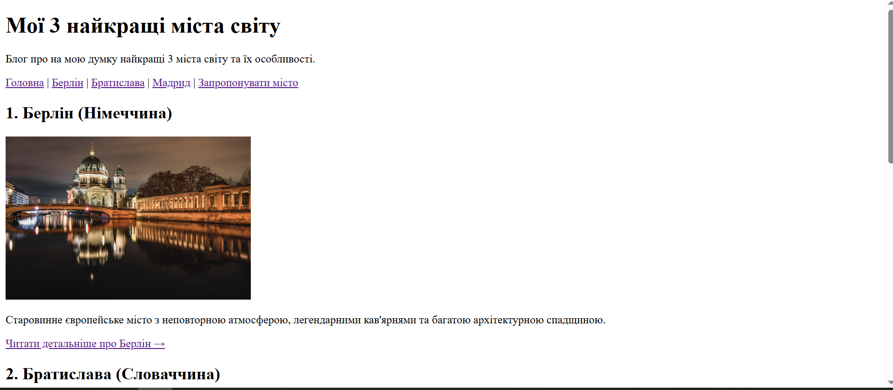

# Звіт до лабораторної роботи № 1

## Тема
**Назва лабораторної роботи:** Імплементація статичного web-блогу «Мої 3 найкращі міста світу» з використанням семантичної HTML-розмітки, організація проєкту в Git-репозиторії, розміщення його на GitHub та розгортання за допомогою GitHub Pages.

## Мета роботи
Метою лабораторної роботи є набуття практичних навичок проєктування та реалізації багатосторінкового статичного web-сайту, його версіювання та публікації в мережі Інтернет.

## Виконання роботи
Під час виконання лабораторної роботи було реалізовано:
* створено базову структуру HTML-документа;
* використано семантичні теги (`header`, `main`, `footer`, `nav` тощо);
* реалізовано навігацію між сторінками сайту;
* додано необхідні текстові та структурні елементи.

## Результат
* **Посилання на опубліковану сторінку:**  
  [ephoriab5 P.S. Ruslan Yablonskyi KN41 pages](https://ephoriab5.github.io/web/)

* **Скріншот результату:**  
  

## Висновок
Під час виконання лабораторної роботи було закріплено навички створення HTML-сторінок, роботи із семантичними тегами та публікації проєкту за допомогою GitHub Pages.